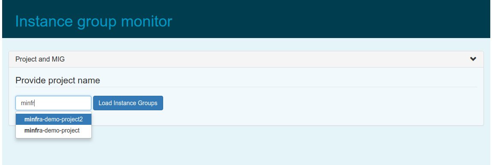
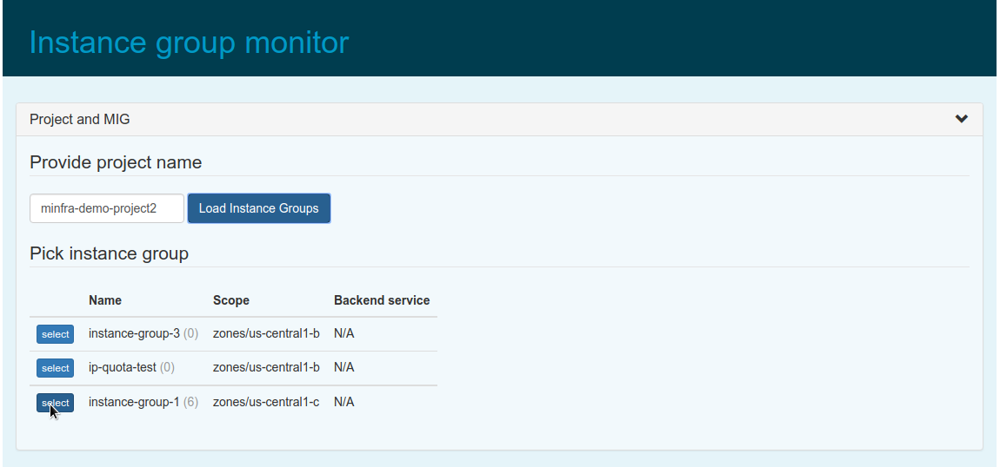
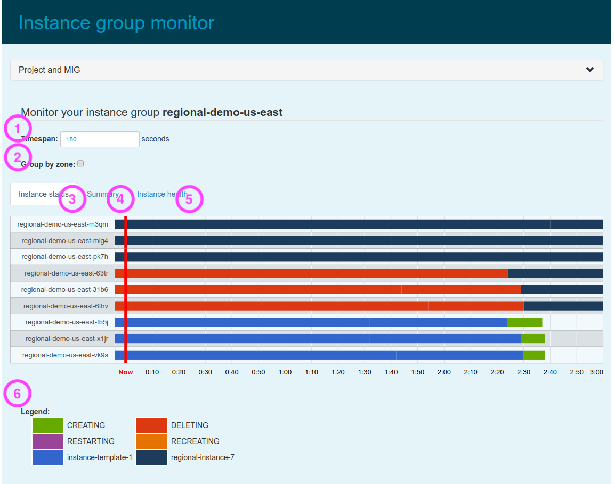

Simple MIG Dashboard
====================

Introduction
------------

Simple MIG dashboard is a tool for monitoring the state of instances of
a Managed Instance Group. For each instance it visualizes its current
action (e.g. *CREATING*, *RESTARTING*) and its Instance Template. It can be
especially useful to monitor progress of a rolling update: it shows how
the state (including health) of each instance is changing over time.

This tutorial explains how to set up and use Simple MIG dashboard on
your local machine with your Google Cloud Platform project. It walks you
through the process of setting up a GCP web application and granting it
all necessary permissions to access your project data.

Simple MIG dashboard is implemented in JavaScript using Angular
framework. It uses Google Charts library for visualization purposes and
Google API Client Library for JavaScript to communicate with Google
Cloud Platform.

Before you begin
----------------

In this tutorial, we assume that you have a Google Cloud Platform
project with an existing Managed Instance Group, which you want to
monitor.

Running the dashboard
---------------------

To run the dashboard locally, you need to set up a new GCP application.
Follow the steps
[here](https://support.google.com/cloud/answer/6158849?hl=en&ref_topic=6262490)
to obtain Client ID, that will be used to identify your application when
making API calls. Choose *Web application* as application type, and add
[http://localhost:8080](http://localhost:8000) to the list
of Authorized JavaScript origins for your app.

Once you obtained Client ID for your application, you are ready to run
the dashboard locally:

1.  `git clone https://github.com/GoogleCloudPlatform/community`

2.  `cd community/tutorials/compute-managed-instance-groups-dashboard/webapp/`

3.  Edit `gapi.js` file: replace *clientId* in line 44 with your Client ID

4.  From `webapp/` run: `python -m SimpleHTTPServer 8080`

Now go to [http://localhost:8080](http://localhost:8080)
in your browser, and you'll be greeted with a window which allows you to
log in to your Google account. Choose the account which has the access
to your GCP project. In the next window, Google will ask for your
permission to allow the Dashboard to view and manage your data across
GCP services.

Once you grant the necessary permissions, you'll see an error stating
that Google Cloud Resource Manager API has not been used in your project
before. Follow the link from the error message to enable it. Give it a
few minutes to propagate, go back to your Simple MIG Dashboard and
refresh the page. Your Dashboard is ready to use.

Overview of the dashboard
-------------------------

It's time to learn how to use the dashboard to monitor the state of your
MIG:

**Step 1.** Choose the name of the project and hit load.



**Step 2.** From the list of Managed Instance Groups in this project select
the one you want to monitor.



**Step 3.** You are now monitoring your MIG.



1.  **Timespan** adjusts horizontal axis of *Instance status* chart.

2.  **Group by zone** is visible only if your MIG is regional. When selected, it will change the order of the machines in the chart to display all machines in one zone together.

3.  **Instance status** tab contains a chart that visualises how instances in your MIG were changing their state over time. In the example from the screenshot above:

    -   Top three instances are using *regional-instance-7* instance template and have been stable for at least 3 minutes.

    -   Three instances in the middle were running *regional-instance-7* instance template, but they are now being deleted for about 2 minutes and 30 seconds.

    -   Bottom three instances were created around 2 minutes and 40 seconds ago from *regional-instance-1* instance template. They were in *CREATING* state for about 10 seconds, and then became stable.

4.  **Summary** displays cumulative information about the status of the machines in the MIG. It allows you to check how many instances there are in each state. Together with *Group by zone*, the Summary tab allows you to see what is happening with your machines in each of the zones.

5.  **Instance health** tab is visible only if your MIG is connected to a Backend Service and has a Health Check configured. If this is the case, each of your machines is reporting its health periodically. The chart displays the changes of health in time for each of the machines.

6.  **Legend** provides information about the colors in the chart.

Code walkthrough
----------------

### Initialization and authentication using gapi

Once the user opens the page, Angular's `ng-init` embeded in the body of
the document runs our `initialize()` function from *main-controller.js*:


```js
<body
  ng-app="migDashboardApp"
  ng-controller="mainController"
  style="margin: 0 5%"
  ng-init="initialize()">
```

`initialize()` is a chain of promises that:

1.  Initializes the JavaScript Google Compute API client with OAuth client ID, scope, and API discovery documents.

2.  Calls Google Authenticator's `signIn()`, which checks if user is logged in with their Google account. If not, it will show a pop up allowing to sign in.

3.  Fetches the list of Google Cloud projects that the user has access to and stores all project IDs.

Once done, `initialize()` clears the message box by calling
`$scope.setMessage()`, unless one of the steps described above threw an
error, in which case the error is displayed to the user.

```js
$scope.initialize = function() {
  $scope.setMessage('Authorizing...', 'loading');

  function onGapiLoaded() {
    getInitializeGapiClientRequest()
      .then(getSignInRequest)
      .then($scope.getProjectIds)
      .then(
          function() {
            $scope.setMessage();
          },
          function(error) {
            $scope.setMessage(
                error.details || error.error || error, 'error');
          });
  }
  gapi.load('client:auth2', onGapiLoaded);
};
```

The component responsible for project choice is defined in
*components/mig-picker.js*. Once the user chooses the project ID, function
`loadInstanceGroups()` is called. It makes several calls to Google Cloud
Compute API to fetch data about Managed Instance Groups belonging to the
project. Progress is reported to the user with calls to `messageFunction`,
which is injected into the `mig-picker` component in *index.html*:


```js
<mig-picker
  on-mig-selected="onInstanceGroupManagerSelected(projectId, gceScope, igm, migId)"
  message-function="setMessage"
  project-list="projectList"></mig-picker>
```

Next, the user chooses the Managed Instance Group to monitor. New object
of `MigHistory` class, defined in *mig-history.js*, is created. `MigHistory`
stores state and health status changes for all instances that belong to
the Managed Instance Group. Every second `MigHistory` is updated by
`fetchInstancesInfo()` method that fetches current state of all the
machines calling the Google Compute API.

`MigHistory` object is injected into `mig-dashboard` component as `vmMap`, and
is used to periodically redraw the status charts:

```js
<mig-dashboard
  message-function="setMessage"
  vm-map="vmMap"
  show-health-chart="showHealthChart"></mig-dashboard>
```
